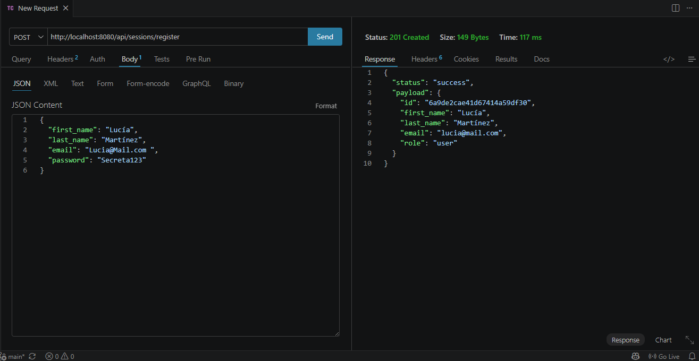
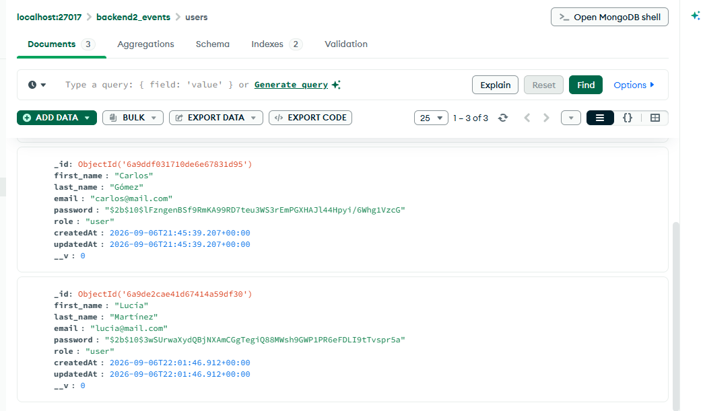

# Backend2 Events - Plataforma de Eventos e Inscripciones

API REST desarrollada con Node.js y Express para una plataforma de eventos e inscripciones.

Este proyecto forma parte del curso Programación Backend II y está organizado utilizando una arquitectura por capas.

## Tecnologías utilizadas

- Node.js
- Express
- MongoDB
- Mongoose
- dotenv
- JavaScript con módulos ESM

## Instalación

Clonar el repositorio e instalar las dependencias:

```bash
npm install
```

## Variables de entorno

Crear un archivo `.env` en la raíz del proyecto tomando como referencia `.env.example`.

Variables utilizadas:

```env
PORT=8080
NODE_ENV=development
MONGO_URL=
JWT_SECRET=
```

## Ejecución

Para iniciar el servidor en modo desarrollo:

```bash
npm run dev
```

Para iniciar el servidor normalmente:

```bash
npm start
```

## Estructura del proyecto

```text
backend2-events/
├── src/
│   ├── app.js
│   ├── server.js
│   ├── config/
│   │   └── config.js
│   ├── routes/
│   │   ├── health.router.js
│   │   ├── events.router.js
│   │   └── sessions.router.js
│   ├── controllers/
│   │   ├── health.controller.js
│   │   ├── events.controller.js
│   │   └── sessions.controller.js
│   ├── services/
│   ├── repositories/
│   ├── dao/
│   ├── models/
│   │   ├── User.js
│   │   └── Event.js
│   ├── middlewares/
│   └── utils/
├── .env.example
├── .gitignore
├── package.json
└── README.md
```

## Rutas disponibles

### Health

```http
GET /api/health
```

Respuesta esperada:

```json
{
  "status": "ok",
  "message": "Servidor activo"
}
```

### Events

```http
GET /api/events
```

Respuesta esperada:

```json
{
  "status": "success",
  "payload": []
}
```

### Sessions

```http
GET /api/sessions
```

Respuesta esperada:

```json
{
  "status": "success",
  "message": "Estructura de sessions disponible"
}
```

## Registro de usuarios

### Endpoint

`POST /api/sessions/register`

Permite registrar un nuevo usuario de forma segura.

### Body esperado

```json
{
  "first_name": "Ana",
  "last_name": "Pérez",
  "email": "ana@mail.com",
  "password": "Secreta123"
}
```

Campos obligatorios:

- `first_name`
- `last_name`
- `email`
- `password`

El email se normaliza eliminando espacios al inicio y al final y convirtiéndolo a minúsculas.

La contraseña debe tener al menos 8 caracteres y se almacena hasheada con bcrypt.

El rol se asigna automáticamente como `user` y no puede modificarse desde el registro público.

### Probar con Thunder Client

1. Abrir Thunder Client en Visual Studio Code.
2. Crear una nueva request.
3. Seleccionar el método `POST`.
4. Usar la siguiente URL:

`http://localhost:8080/api/sessions/register`

5. Ir a `Body > JSON` y enviar:

```json
{
  "first_name": "Ana",
  "last_name": "Pérez",
  "email": "Ana@Mail.com ",
  "password": "Secreta123"
}
```

Resultados esperados:

- `201 Created`: usuario registrado correctamente.
- `400 Bad Request`: campos faltantes, email inválido o contraseña demasiado corta.
- `409 Conflict`: el email ya se encuentra registrado.

En un registro exitoso, el email se devuelve normalizado y la respuesta no incluye el campo `password`.

### Respuesta exitosa

Código HTTP: `201`

```json
{
  "status": "success",
  "payload": {
    "id": "665f2a...",
    "first_name": "Ana",
    "last_name": "Pérez",
    "email": "ana@mail.com",
    "role": "user"
  }
}
```

La contraseña no se incluye en la respuesta.

### Posibles errores

Campos obligatorios faltantes:

```json
{
  "status": "error",
  "message": "Faltan campos obligatorios"
}
```

Email inválido:

```json
{
  "status": "error",
  "message": "El email no es válido"
}
```

Email ya registrado:

```json
{
  "status": "error",
  "message": "El email ya está registrado"
}
```

## Evidencias de funcionamiento

### Registro exitoso

La siguiente captura muestra un registro exitoso mediante `POST /api/sessions/register`.

Se puede observar:

- respuesta `201 Created`;
- email normalizado;
- rol asignado como `user`;
- ausencia del campo `password` en la respuesta.



### Contraseña hasheada en MongoDB

La siguiente captura muestra el usuario persistido en MongoDB con la contraseña protegida mediante bcrypt.

La contraseña no se almacena en texto plano.

