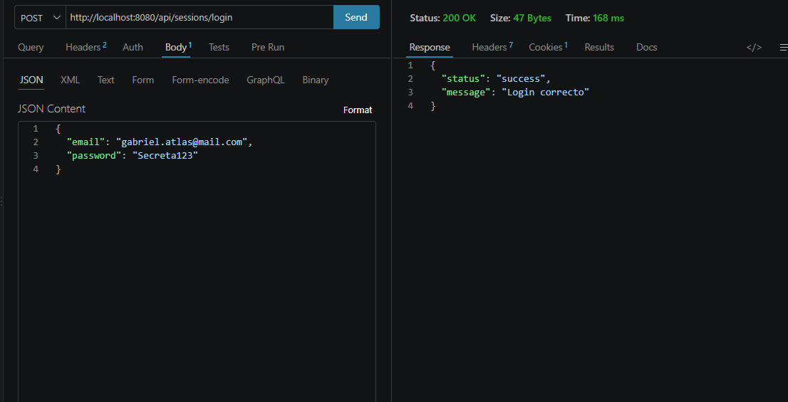
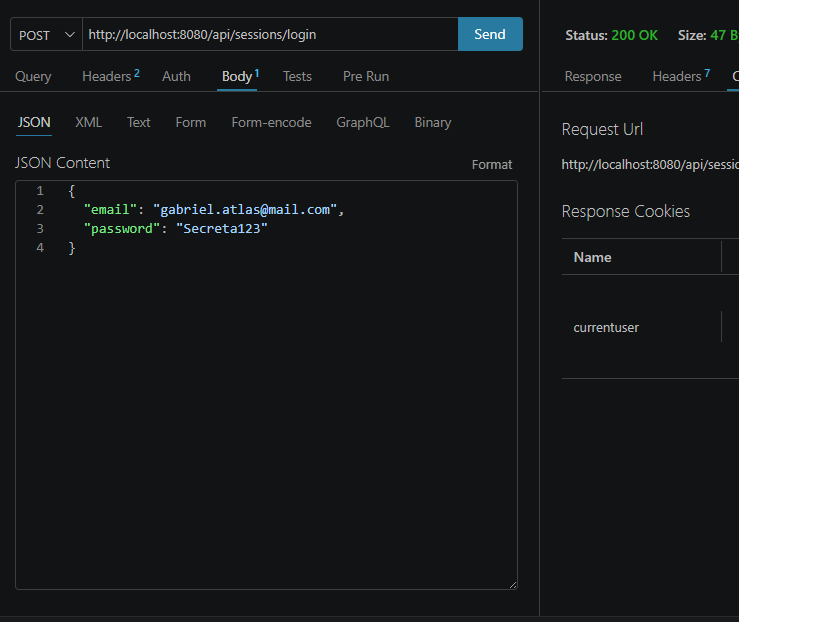
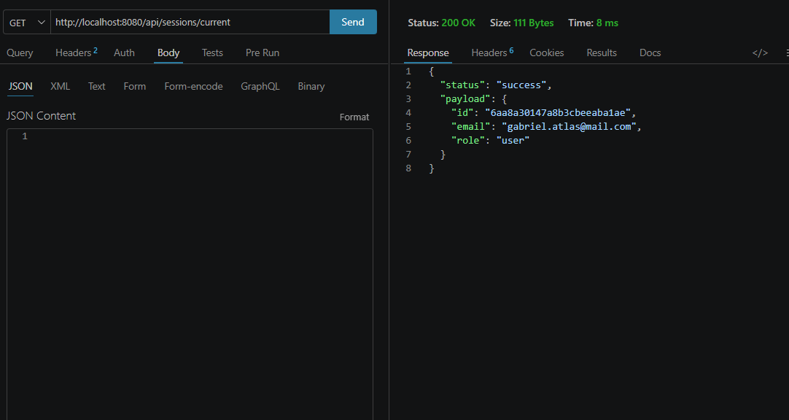
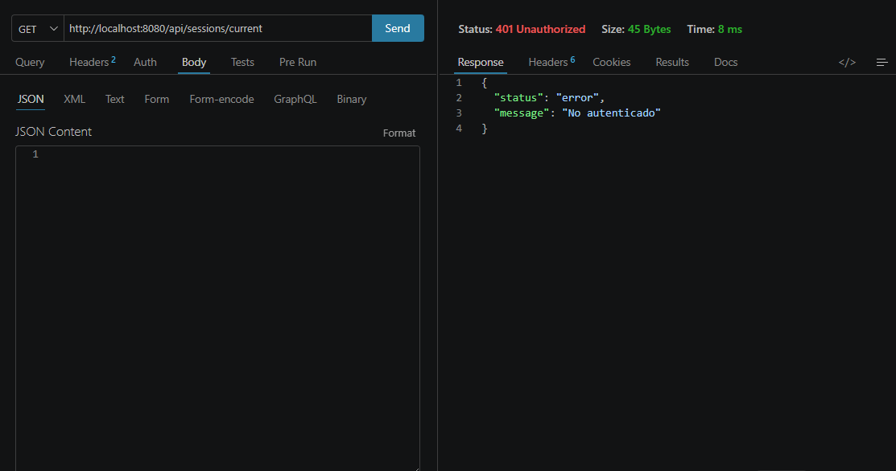

# Backend2 Events - Plataforma de Eventos e Inscripciones

API REST desarrollada con Node.js, Express, MongoDB Atlas y Mongoose para una plataforma de eventos e inscripciones.

El proyecto forma parte del curso **Programación Backend II** y utiliza una arquitectura por capas para separar responsabilidades.

Actualmente incluye:

- registro seguro de usuarios;
- almacenamiento de contraseñas con bcrypt;
- login de usuarios;
- autenticación mediante JWT;
- almacenamiento del JWT en una cookie HTTP Only;
- ruta protegida para consultar al usuario autenticado;
- logout;
- manejo centralizado de errores.

---

## Tecnologías utilizadas

- Node.js
- Express
- MongoDB Atlas
- Mongoose
- dotenv
- bcrypt
- JSON Web Token
- cookie-parser
- Passport.js
- passport-local
- passport-jwt
- JavaScript con módulos ESM
- Thunder Client para pruebas de endpoints
- Git y GitHub

---

## Instalación

Clonar el repositorio e instalar las dependencias:

```bash
npm install
```

---

## Variables de entorno

Crear un archivo `.env` en la raíz del proyecto tomando como referencia `.env.example`.

El archivo `.env.example` contiene:

```env
PORT=8080
NODE_ENV=development
MONGO_URL=
JWT_SECRET=
JWT_EXPIRES_IN=
```

Descripción:

- `PORT`: puerto donde se ejecuta el servidor.
- `NODE_ENV`: entorno de ejecución.
- `MONGO_URL`: URL de conexión a MongoDB Atlas.
- `JWT_SECRET`: clave utilizada para firmar y verificar los JWT.
- `JWT_EXPIRES_IN`: tiempo de expiración de los JWT.

Las credenciales reales se almacenan únicamente en `.env`.

El archivo `.env` no debe subirse al repositorio.

---

## Ejecución

Para iniciar el servidor en modo desarrollo:

```bash
npm run dev
```

Para iniciar el servidor normalmente:

```bash
npm start
```

Por defecto, el servidor se ejecuta en:

```text
http://localhost:8080
```

---

## Base de datos

El proyecto utiliza **MongoDB Atlas** como base de datos y **Mongoose** para la conexión y persistencia.

La conexión se realiza mediante la variable de entorno:

```env
MONGO_URL=
```

La URL real de conexión se guarda únicamente en `.env`.

---

## Estructura del proyecto

```text
backend2-events/
├── src/
│   ├── app.js
│   ├── server.js
│   │
│   ├── config/
│   │   ├── config.js
│   │   ├── database.js
│   │   └── passport.config.js
│   │
│   ├── routes/
│   │   ├── health.router.js
│   │   ├── events.router.js
│   │   └── sessions.router.js
│   │
│   ├── controllers/
│   │   ├── health.controller.js
│   │   ├── events.controller.js
│   │   └── sessions.controller.js
│   │
│   ├── repositories/
│   │   └── users.repository.js
│   │
│   ├── dao/
│   │   └── users.dao.js
│   │
│   ├── models/
│   │   ├── User.js
│   │   └── Event.js
│   │
│   ├── middlewares/
│   │   ├── passport.middleware.js
│   │   └── error.middleware.js
│   │
│   └── utils/
│       ├── hash.js
│       └── jwt.js
│
├── docs/
│   └── evidencias/
│
├── .env.example
├── .gitignore
├── package.json
└── README.md
```

---

# Rutas disponibles

| Método | Ruta | Descripción |
|---|---|---|
| GET | `/api/health` | Verifica que el servidor esté activo |
| GET | `/api/events` | Endpoint inicial de eventos |
| GET | `/api/sessions` | Verifica la estructura de sessions |
| POST | `/api/sessions/register` | Registra un usuario |
| POST | `/api/sessions/login` | Inicia sesión y genera un JWT |
| GET | `/api/sessions/current` | Devuelve el usuario autenticado |
| POST | `/api/sessions/logout` | Cierra la sesión |

---

# Health

## GET `/api/health`

Permite comprobar que el servidor está funcionando.

### Request

```http
GET /api/health
```

### Response 200

```json
{
  "status": "ok",
  "message": "Servidor activo"
}
```

---

# Events

## GET `/api/events`

Endpoint inicial correspondiente al recurso de eventos.

### Request

```http
GET /api/events
```

### Response 200

```json
{
  "status": "success",
  "payload": []
}
```

---

# Sessions

## GET `/api/sessions`

Permite comprobar que la estructura del recurso sessions está disponible.

### Request

```http
GET /api/sessions
```

### Response 200

```json
{
  "status": "success",
  "message": "Estructura de sessions disponible"
}
```

---

# Registro de usuarios

## POST `/api/sessions/register`

Permite registrar un nuevo usuario de forma segura.

### Request

```json
{
  "first_name": "Ana",
  "last_name": "Pérez",
  "email": "ana@mail.com",
  "password": "Secreta123"
}
```

Los campos obligatorios son:

- `first_name`
- `last_name`
- `email`
- `password`

El email se normaliza eliminando espacios al inicio y al final y convirtiéndolo a minúsculas.

La contraseña debe tener al menos 8 caracteres y se almacena hasheada mediante bcrypt.

El rol se asigna automáticamente como:

```text
user
```

El registro público no permite asignar los roles `admin` u `organizer` desde el body.

### Response 201

```json
{
  "status": "success",
  "payload": {
    "id": "665f2a...",
    "first_name": "Ana",
    "last_name": "Pérez",
    "email": "ana@mail.com",
    "role": "user"
  }
}
```

La contraseña no se incluye en la respuesta.

### Error 400 - Campos faltantes

```json
{
  "status": "error",
  "message": "Faltan campos obligatorios"
}
```

### Error 400 - Email inválido

```json
{
  "status": "error",
  "message": "El email no es válido"
}
```

### Error 400 - Contraseña demasiado corta

```json
{
  "status": "error",
  "message": "La contraseña debe tener al menos 8 caracteres"
}
```

### Error 409 - Email duplicado

```json
{
  "status": "error",
  "message": "El email ya está registrado"
}
```

---

# Login

## POST `/api/sessions/login`

Permite iniciar sesión utilizando email y contraseña.

El backend:

1. valida la presencia de email y contraseña;
2. normaliza el email;
3. busca el usuario;
4. compara la contraseña ingresada con el hash almacenado mediante bcrypt;
5. genera un JWT si las credenciales son correctas;
6. guarda el JWT en una cookie HTTP Only llamada `currentUser`.

### Request

```json
{
  "email": "ana@mail.com",
  "password": "Secreta123"
}
```

### Response 200

```json
{
  "status": "success",
  "message": "Login correcto"
}
```

El payload de usuario incluido en el JWT contiene:

```json
{
  "id": "665f2a...",
  "email": "ana@mail.com",
  "role": "user"
}
```

El JWT incorpora además los claims temporales utilizados para controlar su emisión y expiración.

El token se almacena en una cookie llamada:

```text
currentUser
```

La cookie utiliza la siguiente configuración:

```javascript
{
  httpOnly: true,
  sameSite: "lax",
  maxAge: 3600000,
  secure: true // solamente en producción
}
```

### Error 400 - Campos faltantes

```json
{
  "status": "error",
  "message": "Faltan campos obligatorios"
}
```

### Error 401 - Credenciales incorrectas

```json
{
  "status": "error",
  "message": "Credenciales inválidas"
}
```

Por seguridad, el backend devuelve el mismo mensaje tanto si el email no existe como si la contraseña es incorrecta.

---

# Usuario autenticado

## GET `/api/sessions/current`

Ruta protegida que permite consultar al usuario autenticado.

No es necesario volver a enviar email y contraseña.

La estrategia `current` de Passport:

1. lee el JWT desde la cookie `currentUser`;
2. valida la firma y expiración del token;
3. identifica al usuario autenticado;
4. deja sus datos disponibles en `req.user`;
5. permite continuar hacia el controller.

La ruta utiliza Passport con `session: false`, ya que la autenticación del proyecto se mantiene mediante JWT y cookies.

### Request

```http
GET /api/sessions/current
```

La cookie `currentUser` debe estar presente y contener un JWT válido.

### Response 200

```json
{
  "status": "success",
  "payload": {
    "id": "665f2a...",
    "email": "ana@mail.com",
    "role": "user"
  }
}
```

La respuesta no incluye `password`.

### Error 401

```json
{
  "status": "error",
  "message": "No autenticado"
}
```

Se devuelve `401` cuando:

- no existe la cookie;
- el JWT es inválido;
- el JWT fue manipulado;
- el JWT expiró.

---

# Logout

## POST `/api/sessions/logout`

Permite cerrar la sesión del usuario.

El servidor elimina la cookie:

```text
currentUser
```

### Request

```http
POST /api/sessions/logout
```

No requiere body.

### Response 200

```json
{
  "status": "success",
  "message": "Sesión cerrada"
}
```

Después del logout, una nueva petición a:

```http
GET /api/sessions/current
```

debe responder:

```json
{
  "status": "error",
  "message": "No autenticado"
}
```

con código HTTP `401`.

---

# Seguridad

## Contraseñas

Las contraseñas nunca se almacenan en texto plano.

Durante el registro:

```text
password
   ↓
bcrypt.hash()
   ↓
hash
   ↓
MongoDB Atlas
```

Durante el login se utiliza:

```text
bcrypt.compare()
```

para comparar la contraseña recibida con el hash almacenado.

La contraseña no se devuelve en las respuestas de la API.

---

## JWT

La generación y verificación de JWT se encuentra centralizada en:

```text
src/utils/jwt.js
```

El payload de usuario contiene información mínima:

```json
{
  "id": "...",
  "email": "ana@mail.com",
  "role": "user"
}
```

No contiene:

- password;
- hash de password;
- claves secretas;
- credenciales internas.

La firma utiliza la variable de entorno:

```env
JWT_SECRET=
```

La duración del token se configura mediante:

```env
JWT_EXPIRES_IN=
```

La librería JWT agrega los claims necesarios para controlar la emisión y expiración del token.

---

## Cookie de autenticación

El JWT se almacena en una cookie:

```text
currentUser
```

Configurada con:

```text
httpOnly: true
sameSite: lax
maxAge: 3600000
secure: true solamente en producción
```

El flag `httpOnly` impide que JavaScript del navegador pueda leer directamente el token.

---

# Arquitectura

El proyecto utiliza separación de responsabilidades y centraliza la autenticación mediante Passport.js.

El flujo de autenticación queda organizado de la siguiente manera:

```text
Route
  ↓
Passport Strategy
  ↓
Controller
  ↓
Repository
  ↓
DAO
  ↓
Model
  ↓
MongoDB Atlas
```

Responsabilidades principales:

```text
config/passport.config.js
→ centraliza las estrategias de autenticación:
  register, login y current

middlewares/passport.middleware.js
→ ejecuta las estrategias de Passport y mantiene
  el formato de errores de la API

controllers/sessions.controller.js
→ arma las respuestas HTTP;
  en login genera el JWT y configura la cookie currentUser

repositories/users.repository.js
→ abstrae el acceso a los datos de usuarios

dao/users.dao.js
→ realiza las operaciones con el modelo de usuario

utils/hash.js
→ hashing y comparación de contraseñas

utils/jwt.js
→ generación de JWT

middlewares/error.middleware.js
→ manejo centralizado de errores
```

La lógica de autenticación no se encuentra directamente en `app.js`.

`app.js` únicamente inicializa Passport mediante:

```javascript
app.use(passport.initialize());
```

Las estrategias están centralizadas en:

```text
src/config/passport.config.js
```

Esto permite incorporar nuevas estrategias de autenticación en el futuro, como Google o GitHub, sin agregar la lógica de esas estrategias directamente en `app.js`.

Passport.js no reemplaza a JWT, bcrypt ni las cookies.

En este proyecto:

- `register` utiliza una estrategia local para validar y crear usuarios.
- `login` utiliza una estrategia local para validar credenciales.
- `current` utiliza una estrategia JWT para validar al usuario autenticado desde la cookie `currentUser`.
- El controller de login genera el JWT después de una autenticación exitosa.
- Passport trabaja con `session: false`, ya que la autenticación se mantiene mediante JWT y cookies.

---

# Manejo de errores

El proyecto cuenta con un middleware global para centralizar las respuestas de error.

Principales códigos utilizados:

```text
200 → operación exitosa
201 → recurso creado
400 → datos inválidos
401 → no autenticado o credenciales inválidas
409 → conflicto por email duplicado
500 → error interno del servidor
```

---

# Pruebas realizadas

Se verificaron los siguientes casos con la autenticación centralizada mediante Passport.js:

1. Registro exitoso mediante la estrategia `register`.
2. Normalización del email durante el registro.
3. Contraseña almacenada mediante bcrypt.
4. Respuesta de registro sin `password`.
5. Registro con email duplicado devuelve `409`.
6. Login exitoso mediante la estrategia `login`.
7. Login con credenciales inválidas devuelve `401`.
8. Creación de la cookie `currentUser` después del login.
9. `/current` autenticado mediante la estrategia `current` devuelve `200`.
10. `/current` devuelve únicamente `id`, `email` y `role`.
11. `/current` sin cookie devuelve `401`.
12. `/current` con JWT manipulado devuelve `401`.
13. Logout exitoso.
14. `/current` después del logout devuelve `401`.
15. Registro, persistencia y autenticación funcionando con MongoDB Atlas.

El flujo principal verificado fue:

```text
register → login → current → logout → current 401
```

---

# Flujo completo de autenticación

```text
REGISTRO

POST /api/sessions/register
        ↓
validación de datos
        ↓
bcrypt
        ↓
usuario guardado en MongoDB Atlas


LOGIN

POST /api/sessions/login
        ↓
buscar usuario por email
        ↓
bcrypt.compare()
        ↓
generar JWT
        ↓
cookie currentUser HTTP Only


CURRENT

GET /api/sessions/current
        ↓
leer cookie currentUser
        ↓
verificar JWT
        ↓
req.user
        ↓
devolver id, email y role


LOGOUT

POST /api/sessions/logout
        ↓
eliminar cookie currentUser
        ↓
sesión cerrada
```

---

# Evidencias de funcionamiento

## Registro exitoso

La siguiente captura muestra un registro exitoso mediante:

```http
POST /api/sessions/register
```

Se puede observar:

- respuesta `201 Created`;
- email normalizado;
- rol asignado como `user`;
- ausencia del campo `password`.


---

## Contraseña hasheada en MongoDB

La siguiente captura muestra un usuario persistido en MongoDB con la contraseña protegida mediante bcrypt.

La contraseña no se almacena en texto plano.


---

## Login exitoso

La siguiente captura muestra un inicio de sesión exitoso mediante:

```http
POST /api/sessions/login
```

Se puede observar una respuesta `200 OK` con el mensaje:

```text
Login correcto
```



---

## Cookie de autenticación

La siguiente captura muestra la cookie `currentUser` generada después de un login exitoso.

La cookie contiene el JWT que se utiliza para autenticar las peticiones posteriores.



---

## Usuario autenticado

La siguiente captura muestra la ruta protegida:

```http
GET /api/sessions/current
```

respondiendo `200 OK` cuando existe una sesión válida.

La respuesta incluye únicamente:

- `id`;
- `email`;
- `role`.

No se devuelve `password`.



---

## Acceso sin sesión

La siguiente captura muestra la ruta:

```http
GET /api/sessions/current
```

respondiendo `401 Unauthorized` después del logout, cuando ya no existe una cookie de autenticación válida.

La respuesta es:

```json
{
  "status": "error",
  "message": "No autenticado"
}
```



---

# Archivos excluidos del repositorio

El archivo `.gitignore` excluye:

```gitignore
node_modules/
.env
```

Esto evita publicar dependencias locales y credenciales privadas.

El archivo `.env.example` sí se incluye en el repositorio como referencia de configuración.

---

# Repositorio

Proyecto desarrollado como parte del curso **Programación Backend II**.

El código se encuentra versionado mediante Git y GitHub.