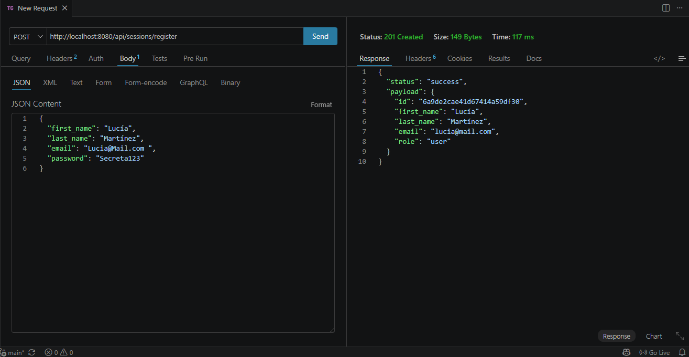
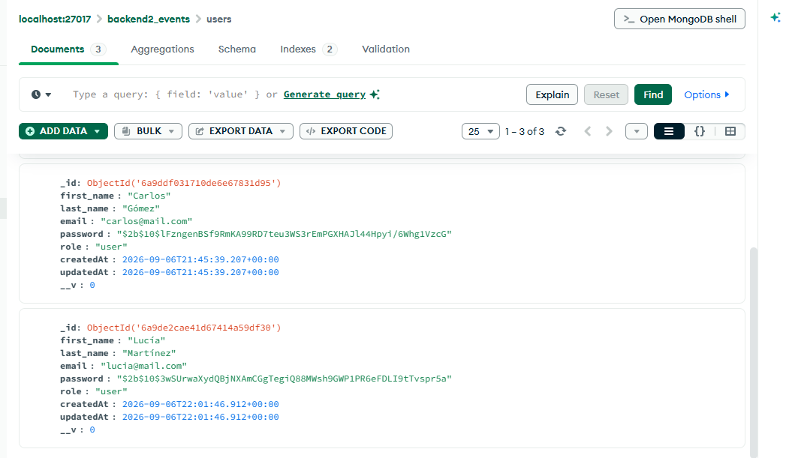
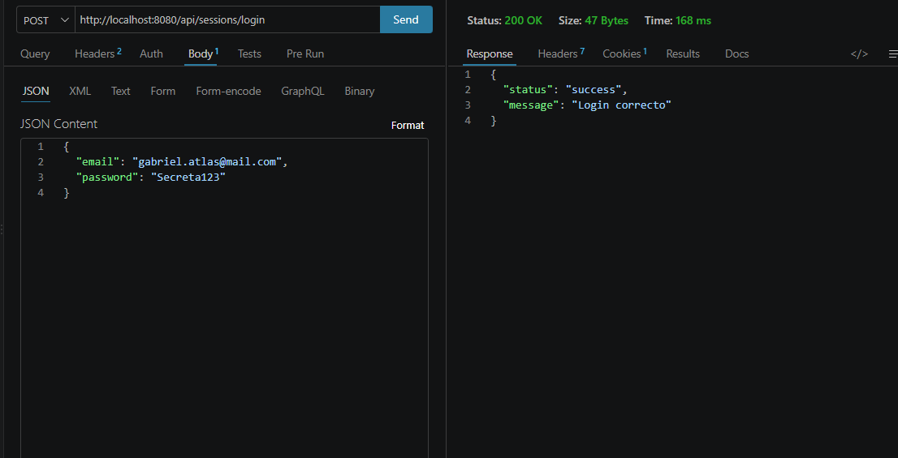
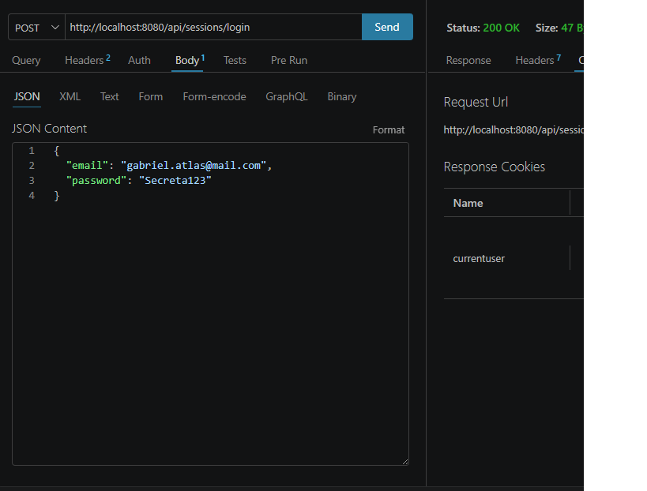
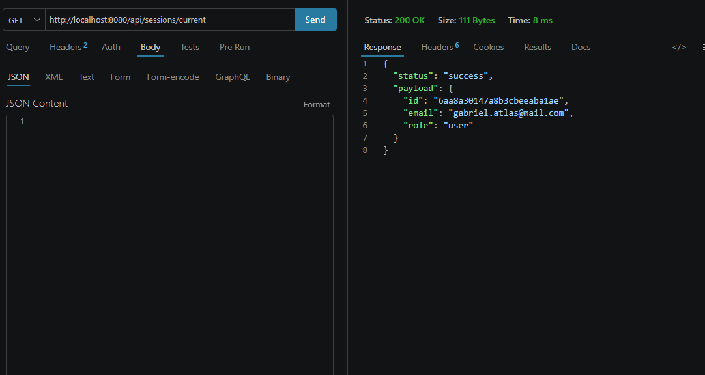
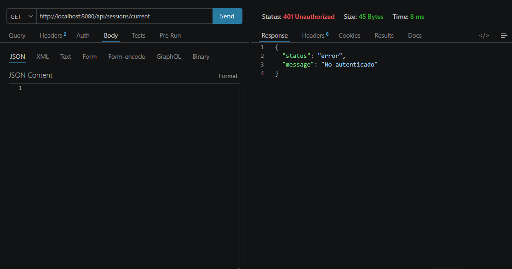

# Backend2 Events - Plataforma de Eventos e Inscripciones

API REST desarrollada con Node.js, Express, MongoDB Atlas y Mongoose para una plataforma de eventos e inscripciones.

El proyecto forma parte del curso **Programación Backend II** y utiliza una arquitectura por capas para separar responsabilidades.

Actualmente incluye:

- registro seguro de usuarios;
- almacenamiento de contraseñas con bcrypt;
- login de usuarios;
- autenticación mediante JWT y Passport.js;
- almacenamiento del JWT en una cookie HTTP Only;
- ruta protegida para consultar al usuario autenticado;
- roles `user`, `organizer` y `admin`;
- autorización mediante una matriz centralizada de permisos;
- middleware reutilizable de autorización por roles;
- protección de rutas según el rol del usuario;
- validación de propiedad de eventos;
- creación de eventos exclusiva para `organizer` y `admin`;
- modificación de eventos propios para `organizer`;
- modificación de cualquier evento para `admin`;
- CRUD de eventos con consulta individual y cambio de estado;
- lógica de negocio de eventos centralizada en la capa `services`;
- validación de fechas, capacidad, precio y estados;
- cancelación lógica de eventos sin eliminación física;
- filtros por estado, categoría, ubicación y rango de fechas;
- paginación y ordenamiento del listado de eventos;
- ruta administrativa para consultar usuarios;
- diferenciación entre errores `401 Unauthorized` y `403 Forbidden`;
- logout;
- manejo centralizado de errores.

---

## Tecnologías utilizadas

- Node.js
- Express
- MongoDB Atlas
- Mongoose
- dotenv
- bcrypt
- JSON Web Token
- cookie-parser
- Passport.js
- passport-local
- passport-jwt
- JavaScript con módulos ESM
- Thunder Client para pruebas de endpoints
- Git y GitHub

---

## Instalación

Clonar el repositorio e instalar las dependencias:

```bash
npm install
```

---

## Variables de entorno

Crear un archivo `.env` en la raíz del proyecto tomando como referencia `.env.example`.

El archivo `.env.example` contiene:

```env
PORT=8080
NODE_ENV=development
MONGO_URL=
JWT_SECRET=
JWT_EXPIRES_IN=
```

Descripción:

- `PORT`: puerto donde se ejecuta el servidor.
- `NODE_ENV`: entorno de ejecución.
- `MONGO_URL`: URL de conexión a MongoDB Atlas.
- `JWT_SECRET`: clave utilizada para firmar y verificar los JWT.
- `JWT_EXPIRES_IN`: tiempo de expiración de los JWT.

Las credenciales reales se almacenan únicamente en `.env`.

El archivo `.env` no debe subirse al repositorio.

---

## Ejecución

Para iniciar el servidor en modo desarrollo:

```bash
npm run dev
```

Para iniciar el servidor normalmente:

```bash
npm start
```

Por defecto, el servidor se ejecuta en:

```text
http://localhost:8080
```

---

## Base de datos

El proyecto utiliza **MongoDB Atlas** como base de datos y **Mongoose** para la conexión y persistencia.

La conexión se realiza mediante la variable de entorno:

```env
MONGO_URL=
```

La URL real de conexión se guarda únicamente en `.env`.

---

## Estructura del proyecto

```text
backend2-events/
├── src/
│   ├── app.js
│   ├── server.js
│   │
│   ├── config/
│   │   ├── config.js
│   │   ├── database.js
│   │   ├── passport.config.js
│   │   └── permissions.config.js
│   │
│   ├── routes/
│   │   ├── health.router.js
│   │   ├── events.router.js
│   │   ├── sessions.router.js
│   │   └── users.router.js
│   │
│   ├── controllers/
│   │   ├── health.controller.js
│   │   ├── events.controller.js
│   │   ├── sessions.controller.js
│   │   └── users.controller.js
│   │
│   ├── services/
│   │   └── events.service.js
│   │
│   ├── repositories/
│   │   ├── users.repository.js
│   │   └── events.repository.js
│   │
│   ├── dao/
│   │   ├── users.dao.js
│   │   └── events.dao.js
│   │
│   ├── models/
│   │   ├── User.js
│   │   └── Event.js
│   │
│   ├── middlewares/
│   │   ├── passport.middleware.js
│   │   ├── authorize.middleware.js
│   │   └── error.middleware.js
│   │
│   └── utils/
│       ├── hash.js
│       └── jwt.js
│
├── docs/
│   └── evidencias/
│
├── .env.example
├── .gitignore
├── package.json
└── README.md
```

---

# Rutas disponibles

| Método | Ruta | Acceso | Descripción |
|---|---|---|---|
| GET | `/api/health` | Público | Verifica que el servidor esté activo |
| GET | `/api/events` | Público | Lista eventos con filtros, paginación y ordenamiento |
| GET | `/api/events/:id` | Público | Consulta el detalle de un evento |
| POST | `/api/events` | `organizer`, `admin` | Crea un evento |
| PUT | `/api/events/:id` | Dueño del evento o `admin` | Modifica un evento |
| PATCH | `/api/events/:id/status` | Dueño del evento o `admin` | Cambia el estado de un evento |
| GET | `/api/sessions` | Público | Verifica la estructura de sessions |
| POST | `/api/sessions/register` | Público | Registra un usuario con rol `user` |
| POST | `/api/sessions/login` | Público | Inicia sesión y genera un JWT |
| GET | `/api/sessions/current` | Autenticado | Devuelve el usuario autenticado |
| POST | `/api/sessions/logout` | Público | Cierra la sesión |
| GET | `/api/users` | `admin` | Consulta todos los usuarios |

---

# Roles y autorización

El sistema utiliza tres roles:

- `user`: usuario común de la plataforma.
- `organizer`: usuario autorizado para crear y administrar sus propios eventos.
- `admin`: administrador con permisos generales sobre la plataforma.

El registro público siempre crea usuarios con el rol:

```text
user
```

Los roles `organizer` y `admin` no pueden asignarse desde el body de registro.

## Diferencia entre 401 y 403

El proyecto diferencia autenticación de autorización.

### 401 Unauthorized

Se devuelve cuando el usuario no posee una sesión válida.

Ejemplo:

```http
GET /api/sessions/current
```

sin la cookie `currentUser`.

Respuesta:

```json
{
  "status": "error",
  "message": "No autenticado"
}
```

Código HTTP:

```text
401 Unauthorized
```

### 403 Forbidden

Se devuelve cuando el usuario está autenticado, pero su rol no tiene permisos para realizar la acción solicitada.

Ejemplo:

```http
POST /api/events
```

con un usuario autenticado cuyo rol es `user`.

Respuesta:

```json
{
  "status": "error",
  "message": "No tenés permisos para realizar esta acción"
}
```

Código HTTP:

```text
403 Forbidden
```

En resumen:

```text
401 → el usuario no está autenticado
403 → el usuario está autenticado, pero no tiene permisos
```

## Matriz de permisos

| Acción | user | organizer | admin |
|---|---:|---:|---:|
| Consultar eventos publicados | ✅ | ✅ | ✅ |
| Crear eventos | ❌ | ✅ | ✅ |
| Modificar/cancelar eventos propios | ❌ | ✅ | ✅ |
| Modificar cualquier evento | ❌ | ❌ | ✅ |
| Ver todos los usuarios | ❌ | ❌ | ✅ |

La definición centralizada de permisos se encuentra en:

```text
src/config/permissions.config.js
```

Las rutas no deciden directamente qué roles están permitidos. Utilizan el middleware reutilizable:

```text
src/middlewares/authorize.middleware.js
```

junto con la matriz de permisos.

# Health

## GET `/api/health`

Permite comprobar que el servidor está funcionando.

### Request

```http
GET /api/health
```

### Response 200

```json
{
  "status": "ok",
  "message": "Servidor activo"
}
```

---

# Events

La API permite crear, consultar, actualizar y cambiar el estado de eventos.

Los eventos pueden tener los siguientes estados:

```text
draft
published
cancelled
finished
```

Un evento nuevo siempre se crea con estado:

```text
draft
```

El campo `organizer` se asigna automáticamente utilizando el usuario autenticado (`req.user`) y no puede definirse manualmente desde el body.

---

## GET `/api/events`

Ruta pública que permite listar eventos con filtros, paginación y ordenamiento.

### Filtros disponibles

```text
status
category
location
dateFrom
dateTo
```

También admite:

```text
page
limit
sort
```

### Ejemplo

```http
GET /api/events?status=published&category=workshop&page=2&limit=5
```

### Ordenamiento

Por defecto:

```text
sort=date
```

ordena por fecha ascendente.

Para ordenar de forma descendente se puede anteponer `-`:

```text
sort=-date
```

Los campos admitidos para ordenamiento son:

```text
date
price
title
createdAt
```

### Response 200

```json
{
  "status": "success",
  "data": [],
  "page": 1,
  "limit": 10,
  "total": 0,
  "totalPages": 0
}
```

La respuesta siempre incluye:

```text
data
page
limit
total
totalPages
```

### Ejemplo de filtro por rango de fechas

```http
GET /api/events?dateFrom=2027-01-01&dateTo=2027-12-31
```

Si `dateFrom` es posterior a `dateTo`, la API devuelve `400 Bad Request`.

---

## GET `/api/events/:id`

Ruta pública que permite consultar el detalle de un evento.

### Request

```http
GET /api/events/66abc123...
```

### Response 200

```json
{
  "status": "success",
  "payload": {
    "_id": "66abc123...",
    "title": "Workshop Backend II",
    "description": "Evento de ejemplo",
    "category": "workshop",
    "date": "2027-05-20T18:00:00.000Z",
    "location": "Mar del Plata",
    "capacity": 50,
    "price": 10000,
    "status": "draft",
    "organizer": "665f2a..."
  }
}
```

### Error 400 - ID inválido

```json
{
  "status": "error",
  "message": "El ID del evento no es válido"
}
```

### Error 404 - Evento inexistente

```json
{
  "status": "error",
  "message": "Evento no encontrado"
}
```

---

## POST `/api/events`

Permite crear un evento.

Requiere autenticación y rol:

```text
organizer
admin
```

Los usuarios con rol `user` reciben `403 Forbidden`.

### Request

```json
{
  "title": "Workshop Backend II",
  "description": "Encuentro práctico sobre desarrollo backend",
  "category": "workshop",
  "date": "2027-05-20T18:00:00.000Z",
  "location": "Mar del Plata",
  "capacity": 50,
  "price": 10000
}
```

El cliente no controla:

```text
organizer
status
```

El backend asigna:

```text
organizer → req.user.id
status → draft
```

### Response 201

```json
{
  "status": "success",
  "payload": {
    "id": "66abc123...",
    "title": "Workshop Backend II",
    "organizer": "665f2a..."
  }
}
```

### Reglas de negocio

Al crear un evento:

- `title`, `description`, `category` y `location` son obligatorios.
- La fecha no puede estar en el pasado.
- `capacity` debe ser mayor a `0`.
- `price` debe ser mayor o igual a `0`.
- `organizer` se obtiene del usuario autenticado.
- `status` se establece automáticamente como `draft`.

---

## PUT `/api/events/:id`

Permite modificar un evento.

Puede utilizarlo:

```text
organizer dueño del evento
admin
```

Un `organizer` no puede modificar eventos creados por otro usuario.

### Request

```json
{
  "title": "Workshop Backend II Actualizado",
  "capacity": 100,
  "price": 12000
}
```

Los campos:

```text
organizer
status
```

no pueden modificarse mediante `PUT`.

El cambio de estado se realiza exclusivamente mediante:

```text
PATCH /api/events/:id/status
```

### Reglas de negocio

- Un evento `cancelled` no puede modificarse.
- La fecha no puede modificarse por una fecha pasada.
- `capacity` debe mantenerse mayor a `0`.
- `price` debe mantenerse mayor o igual a `0`.
- Los campos de texto obligatorios no pueden quedar vacíos.

### Error 403 - Evento ajeno

```json
{
  "status": "error",
  "message": "No tenés permisos para modificar este evento"
}
```

---

## PATCH `/api/events/:id/status`

Permite modificar el estado de un evento.

Puede utilizarlo:

```text
organizer dueño del evento
admin
```

### Request

```json
{
  "status": "published"
}
```

Estados válidos:

```text
draft
published
cancelled
finished
```

### Cancelación

Para cancelar un evento:

```json
{
  "status": "cancelled"
}
```

La cancelación es lógica.

El documento no se elimina de MongoDB.

### Reglas de negocio

- Un evento cancelado no puede cambiar nuevamente de estado.
- Un evento finalizado no puede volver a `published`.
- Un evento cuya fecha ya pasó no puede publicarse.
- Los valores de estado fuera de los permitidos devuelven `400 Bad Request`.

### Response 200

```json
{
  "status": "success",
  "payload": {
    "id": "66abc123...",
    "title": "Workshop Backend II",
    "status": "published",
    "organizer": "665f2a..."
  }
}
```

---

## Lógica de negocio de eventos

La lógica de negocio correspondiente a eventos se encuentra centralizada en:

```text
src/services/events.service.js
```

Los controllers se limitan a manejar request y response.

El acceso a datos se mantiene separado mediante:

```text
Controller
↓
Service
↓
Repository
↓
DAO
↓
MongoDB
```

Las reglas principales implementadas incluyen:

- validación de campos obligatorios;
- control de fechas pasadas;
- validación de capacidad;
- validación de precio;
- protección de eventos cancelados;
- control de cambios de estado;
- asignación automática del organizador;
- filtros;
- paginación;
- ordenamiento;
- validación de propiedad del recurso.

---

# Sessions

## GET `/api/sessions`

Permite comprobar que la estructura del recurso sessions está disponible.

### Request

```http
GET /api/sessions
```

### Response 200

```json
{
  "status": "success",
  "message": "Estructura de sessions disponible"
}
```

---

# Registro de usuarios

## POST `/api/sessions/register`

Permite registrar un nuevo usuario de forma segura.

### Request

```json
{
  "first_name": "Ana",
  "last_name": "Pérez",
  "email": "ana@mail.com",
  "password": "Secreta123"
}
```

Los campos obligatorios son:

- `first_name`
- `last_name`
- `email`
- `password`

El email se normaliza eliminando espacios al inicio y al final y convirtiéndolo a minúsculas.

La contraseña debe tener al menos 8 caracteres y se almacena hasheada mediante bcrypt.

El rol se asigna automáticamente como:

```text
user
```

El registro público no permite asignar los roles `admin` u `organizer` desde el body.

### Response 201

```json
{
  "status": "success",
  "payload": {
    "id": "665f2a...",
    "first_name": "Ana",
    "last_name": "Pérez",
    "email": "ana@mail.com",
    "role": "user"
  }
}
```

La contraseña no se incluye en la respuesta.

### Error 400 - Campos faltantes

```json
{
  "status": "error",
  "message": "Faltan campos obligatorios"
}
```

### Error 400 - Email inválido

```json
{
  "status": "error",
  "message": "El email no es válido"
}
```

### Error 400 - Contraseña demasiado corta

```json
{
  "status": "error",
  "message": "La contraseña debe tener al menos 8 caracteres"
}
```

### Error 409 - Email duplicado

```json
{
  "status": "error",
  "message": "El email ya está registrado"
}
```

---

# Login

## POST `/api/sessions/login`

Permite iniciar sesión utilizando email y contraseña.

El backend:

1. valida la presencia de email y contraseña;
2. normaliza el email;
3. busca el usuario;
4. compara la contraseña ingresada con el hash almacenado mediante bcrypt;
5. genera un JWT si las credenciales son correctas;
6. guarda el JWT en una cookie HTTP Only llamada `currentUser`.

### Request

```json
{
  "email": "ana@mail.com",
  "password": "Secreta123"
}
```

### Response 200

```json
{
  "status": "success",
  "message": "Login correcto"
}
```

El payload de usuario incluido en el JWT contiene:

```json
{
  "id": "665f2a...",
  "email": "ana@mail.com",
  "role": "user"
}
```

El JWT incorpora además los claims temporales utilizados para controlar su emisión y expiración.

El token se almacena en una cookie llamada:

```text
currentUser
```

La cookie utiliza la siguiente configuración:

```javascript
{
  httpOnly: true,
  sameSite: "lax",
  maxAge: 3600000,
  secure: true // solamente en producción
}
```

### Error 400 - Campos faltantes

```json
{
  "status": "error",
  "message": "Faltan campos obligatorios"
}
```

### Error 401 - Credenciales incorrectas

```json
{
  "status": "error",
  "message": "Credenciales inválidas"
}
```

Por seguridad, el backend devuelve el mismo mensaje tanto si el email no existe como si la contraseña es incorrecta.

---

# Usuario autenticado

## GET `/api/sessions/current`

Ruta protegida que permite consultar al usuario autenticado.

No es necesario volver a enviar email y contraseña.

La estrategia `current` de Passport:

1. lee el JWT desde la cookie `currentUser`;
2. valida la firma y expiración del token;
3. identifica al usuario autenticado;
4. deja sus datos disponibles en `req.user`;
5. permite continuar hacia el controller.

La ruta utiliza Passport con `session: false`, ya que la autenticación del proyecto se mantiene mediante JWT y cookies.

### Request

```http
GET /api/sessions/current
```

La cookie `currentUser` debe estar presente y contener un JWT válido.

### Response 200

```json
{
  "status": "success",
  "payload": {
    "id": "665f2a...",
    "email": "ana@mail.com",
    "role": "user"
  }
}
```

La respuesta no incluye `password`.

### Error 401

```json
{
  "status": "error",
  "message": "No autenticado"
}
```

Se devuelve `401` cuando:

- no existe la cookie;
- el JWT es inválido;
- el JWT fue manipulado;
- el JWT expiró.

---

# Logout

## POST `/api/sessions/logout`

Permite cerrar la sesión del usuario.

El servidor elimina la cookie:

```text
currentUser
```

### Request

```http
POST /api/sessions/logout
```

No requiere body.

### Response 200

```json
{
  "status": "success",
  "message": "Sesión cerrada"
}
```

Después del logout, una nueva petición a:

```http
GET /api/sessions/current
```

debe responder:

```json
{
  "status": "error",
  "message": "No autenticado"
}
```

con código HTTP `401`.

---

# Seguridad

## Contraseñas

Las contraseñas nunca se almacenan en texto plano.

Durante el registro:

```text
password
   ↓
bcrypt.hash()
   ↓
hash
   ↓
MongoDB Atlas
```

Durante el login se utiliza:

```text
bcrypt.compare()
```

para comparar la contraseña recibida con el hash almacenado.

La contraseña no se devuelve en las respuestas de la API.

---

## JWT

La generación de JWT se encuentra centralizada en:

```text
src/utils/jwt.js
```

La validación del JWT utilizado por `/api/sessions/current` se realiza mediante la estrategia `current` de Passport, configurada con `passport-jwt` en:

```text
src/config/passport.config.js
```

Esta estrategia obtiene el token desde la cookie `currentUser` y valida su firma utilizando `JWT_SECRET`.

El payload de usuario contiene información mínima:

```json
{
  "id": "...",
  "email": "ana@mail.com",
  "role": "user"
}
```

No contiene:

- password;
- hash de password;
- claves secretas;
- credenciales internas.

La firma utiliza la variable de entorno:

```env
JWT_SECRET=
```

La duración del token se configura mediante:

```env
JWT_EXPIRES_IN=
```

La librería JWT agrega los claims necesarios para controlar la emisión y expiración del token.

---

## Cookie de autenticación

El JWT se almacena en una cookie:

```text
currentUser
```

Configurada con:

```text
httpOnly: true
sameSite: lax
maxAge: 3600000
secure: true solamente en producción
```

El flag `httpOnly` impide que JavaScript del navegador pueda leer directamente el token.

---

# Arquitectura

El proyecto utiliza separación de responsabilidades y centraliza la autenticación mediante Passport.js.

El flujo de autenticación queda organizado de la siguiente manera:

```text
Route
  ↓
Autenticación / Autorización
  ↓
Controller
  ↓
Service
  ↓
Repository
  ↓
DAO
  ↓
Model
  ↓
MongoDB Atlas
```

Responsabilidades principales:

```text
config/passport.config.js
→ centraliza las estrategias de autenticación:
  register, login y current

middlewares/passport.middleware.js
→ encapsula passport.authenticate() para ejecutar las estrategias
  register, login y current con session: false, manteniendo
  los códigos HTTP y el formato de errores de la API

config/permissions.config.js
→ centraliza la matriz de permisos por rol

middlewares/authorize.middleware.js
→ valida roles permitidos y propiedad de eventos;
  devuelve 401 si no existe usuario autenticado
  y 403 cuando el usuario no tiene permisos

controllers/sessions.controller.js
→ arma las respuestas HTTP;
  en login genera el JWT y configura la cookie currentUser

services/events.service.js
→ concentra la lógica de negocio de eventos:
  validaciones de fechas, capacidad, precio y estados;
  filtros, paginación y ordenamiento;
  impide modificaciones incoherentes sobre eventos cancelados

repositories/users.repository.js
→ abstrae el acceso a los datos de usuarios

dao/users.dao.js
→ realiza las operaciones con el modelo de usuario

utils/hash.js
→ hashing y comparación de contraseñas

utils/jwt.js
→ generación de JWT

middlewares/error.middleware.js
→ manejo centralizado de errores
```

La lógica de autenticación no se encuentra directamente en `app.js`.

`app.js` únicamente inicializa Passport mediante:

```javascript
app.use(passport.initialize());
```

Las estrategias están centralizadas en:

```text
src/config/passport.config.js
```

Esto permite incorporar nuevas estrategias de autenticación en el futuro, como Google o GitHub, sin agregar la lógica de esas estrategias directamente en `app.js`.

Passport.js no reemplaza a JWT, bcrypt ni las cookies.

En este proyecto:

- `register` utiliza una estrategia local para validar y crear usuarios.
- `login` utiliza una estrategia local para validar credenciales.
- `current` utiliza una estrategia JWT para validar al usuario autenticado desde la cookie `currentUser`.
- El controller de login genera el JWT después de una autenticación exitosa.
- Passport trabaja con `session: false`, ya que la autenticación se mantiene mediante JWT y cookies.
- `authorizeRoles` valida si el rol del usuario autenticado se encuentra dentro de los roles permitidos.
- `authorizeEventOwnerOrAdmin` valida la propiedad del evento y permite que un `admin` modifique cualquier evento.
- La matriz de permisos se encuentra centralizada en `src/config/permissions.config.js`, evitando definir roles directamente dentro de las rutas.

---

# Manejo de errores

El proyecto cuenta con un middleware global para centralizar las respuestas de error.

Principales códigos utilizados:

```text
200 → operación exitosa
201 → recurso creado
400 → datos inválidos
401 → no autenticado o credenciales inválidas
403 → autenticado pero sin permisos para realizar la acción
409 → conflicto por email duplicado
500 → error interno del servidor
```

---

# Pruebas realizadas

Se verificaron los siguientes casos con la autenticación centralizada mediante Passport.js:

1. Registro exitoso mediante la estrategia `register`.
2. Normalización del email durante el registro.
3. Contraseña almacenada mediante bcrypt.
4. Respuesta de registro sin `password`.
5. Registro con email duplicado devuelve `409`.
6. Login exitoso mediante la estrategia `login`.
7. Login con credenciales inválidas devuelve `401`.
8. Creación de la cookie `currentUser` después del login.
9. `/current` autenticado mediante la estrategia `current` devuelve `200`.
10. `/current` devuelve únicamente `id`, `email` y `role`.
11. `/current` sin cookie devuelve `401`.
12. `/current` con JWT manipulado devuelve `401`.
13. Logout exitoso.
14. `/current` después del logout devuelve `401`.
15. Registro, persistencia y autenticación funcionando con MongoDB Atlas.

El flujo principal verificado fue:

```text
register → login → current → logout → current 401
```

---

# Flujo completo de autenticación

```text
REGISTRO

POST /api/sessions/register
        ↓
validación de datos
        ↓
bcrypt
        ↓
usuario guardado en MongoDB Atlas


LOGIN

POST /api/sessions/login
        ↓
buscar usuario por email
        ↓
bcrypt.compare()
        ↓
generar JWT
        ↓
cookie currentUser HTTP Only


CURRENT

GET /api/sessions/current
        ↓
leer cookie currentUser
        ↓
verificar JWT
        ↓
req.user
        ↓
devolver id, email y role


LOGOUT

POST /api/sessions/logout
        ↓
eliminar cookie currentUser
        ↓
sesión cerrada
```

## Pruebas de roles y autorización

También se verificaron los siguientes casos correspondientes al sistema de autorización:

1. `POST /api/events` sin sesión devuelve `401 Unauthorized`.
2. `POST /api/events` con rol `user` devuelve `403 Forbidden`.
3. `POST /api/events` con rol `organizer` crea el evento y devuelve `201 Created`.
4. Un `organizer` puede modificar su propio evento mediante `PUT /api/events/:eventId`.
5. `GET /api/users` con rol `organizer` devuelve `403 Forbidden`.
6. `GET /api/users` con rol `admin` devuelve `200 OK`.
7. Un `admin` puede modificar un evento creado por otro usuario.
8. Un `organizer` intentando modificar un evento ajeno recibe `403 Forbidden`.
9. `GET /api/sessions/current` con sesión válida devuelve `200 OK` y el rol del usuario.
10. `GET /api/sessions/current` después del logout devuelve `401 Unauthorized`.
11. El campo `organizer` no puede modificarse enviándolo desde el body de actualización.

El flujo de autorización verificado fue:

```text
sin sesión
   ↓
401 Unauthorized

usuario autenticado
   ↓
validación de rol
   ├── rol no permitido → 403 Forbidden
   └── rol permitido
          ↓
      validación de propiedad
          ├── recurso ajeno → 403 Forbidden
          └── dueño o admin → operación permitida
```

## Pruebas de eventos y lógica de negocio

Se verificaron los siguientes casos correspondientes a la gestión de eventos:

1. Crear evento con rol `user` devuelve `403 Forbidden`.
2. Crear evento con fecha pasada devuelve `400 Bad Request`.
3. Crear evento con `capacity: 0` devuelve `400 Bad Request`.
4. Crear evento con `price < 0` devuelve `400 Bad Request`.
5. Crear evento válido con `organizer` devuelve `201 Created`.
6. El `organizer` se asigna automáticamente desde `req.user`.
7. El `status` inicial se fuerza a `draft`.
8. Consultar un evento por ID válido devuelve `200 OK`.
9. Consultar un evento inexistente devuelve `404 Not Found`.
10. Consultar un evento con ID inválido devuelve `400 Bad Request`.
11. `organizer` puede modificar su propio evento.
12. `organizer` no puede modificar un evento ajeno y recibe `403 Forbidden`.
13. `admin` puede modificar un evento creado por otro organizador.
14. Un evento `cancelled` no puede modificarse mediante `PUT`.
15. Un evento `cancelled` no puede cambiar nuevamente de estado.
16. Un evento `finished` no puede volver a `published`.
17. Un evento cuya fecha ya pasó no puede publicarse.
18. `PUT` no permite modificar `organizer`.
19. `PUT` no permite modificar `status`.
20. `PUT` rechaza campos de texto obligatorios vacíos.
21. `PUT` rechaza `capacity <= 0`.
22. `PUT` rechaza `price < 0`.
23. `PUT` rechaza una fecha pasada.
24. `GET /api/events` devuelve paginación y metadata.
25. Se verificó el filtro por `status`.
26. Se verificó el filtro por `category`.
27. Se verificó el filtro por `location`.
28. Se verificó el filtro por rango de fechas.
29. Se verificó `page` y `limit`.
30. Se verificó ordenamiento ascendente y descendente por fecha.
31. Un rango con `dateFrom > dateTo` devuelve `400 Bad Request`.
32. Un valor inválido de `status` devuelve `400 Bad Request`.
33. Un valor inválido de `sort` devuelve `400 Bad Request`.
34. `page <= 0` devuelve `400 Bad Request`.
35. `limit <= 0` devuelve `400 Bad Request`.

También se verificó explícitamente el caso indicado en la consigna:

```http
GET /api/events?status=published&category=workshop&page=2&limit=5
```

La respuesta incluye:

```text
data
page
limit
total
totalPages
```

---

# Evidencias de funcionamiento

## Registro exitoso

La siguiente captura muestra un registro exitoso mediante:

```http
POST /api/sessions/register
```

Se puede observar:

- respuesta `201 Created`;
- email normalizado;
- rol asignado como `user`;
- ausencia del campo `password`.



---

## Contraseña hasheada en MongoDB

La siguiente captura muestra un usuario persistido en MongoDB con la contraseña protegida mediante bcrypt.

La contraseña no se almacena en texto plano.



---

## Login exitoso

La siguiente captura muestra un inicio de sesión exitoso mediante:

```http
POST /api/sessions/login
```

Se puede observar una respuesta `200 OK` con el mensaje:

```text
Login correcto
```



---

## Cookie de autenticación

La siguiente captura muestra la cookie `currentUser` generada después de un login exitoso.

La cookie contiene el JWT que se utiliza para autenticar las peticiones posteriores.



---

## Usuario autenticado

La siguiente captura muestra la ruta protegida:

```http
GET /api/sessions/current
```

respondiendo `200 OK` cuando existe una sesión válida.

La respuesta incluye únicamente:

- `id`;
- `email`;
- `role`.

No se devuelve `password`.



---

## Acceso sin sesión

La siguiente captura muestra la ruta:

```http
GET /api/sessions/current
```

respondiendo `401 Unauthorized` después del logout, cuando ya no existe una cookie de autenticación válida.

La respuesta es:

```json
{
  "status": "error",
  "message": "No autenticado"
}
```



---

# Archivos excluidos del repositorio

El archivo `.gitignore` excluye:

```gitignore
node_modules/
.env
```

Esto evita publicar dependencias locales y credenciales privadas.

El archivo `.env.example` sí se incluye en el repositorio como referencia de configuración.

---

# Repositorio

Proyecto desarrollado como parte del curso **Programación Backend II**.

El código se encuentra versionado mediante Git y GitHub.